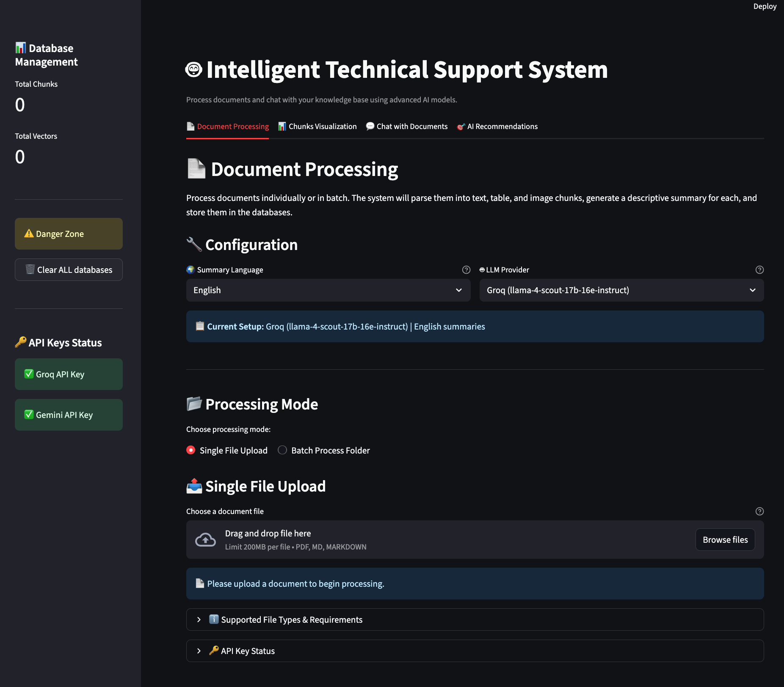

# 🤖 TraceRAG - Intelligent Technical Support System

[](https://www.python.org/downloads/)
[](https://streamlit.io/)
[](LICENSE)
[](https://github.com/your-repo)

> **An intelligent technical support system with personalized recommendations for the Shakers platform, featuring multimodal RAG capabilities and real-time AI-powered chat interface.**

---

## 📋 Table of Contents

- [🎯 Project Overview](#-project-overview)
- [✨ Key Features](#-key-features)
- [🏗️ System Architecture](#️-system-architecture)
- [🚀 Installation](#-installation)
  - [Using UV (Recommended)](#using-uv-recommended)
  - [Using Docker](#using-docker)
- [📊 RAG Pipeline Explanation](#-rag-pipeline-explanation)
- [🤖 AI Models & APIs](#-ai-models--apis)
- [💬 Chat & Recommendation Flow](#-chat--recommendation-flow)
- [🖥️ User Interface](#️-user-interface)
- [📁 Project Structure](#-project-structure)
- [⚡ Performance](#-performance)
- [🧪 Testing](#-testing)
- [📈 Metrics & Monitoring](#-metrics--monitoring)
- [🤝 Contributing](#-contributing)
- [📄 License](#-license)

---

## 🎯 Project Overview

**TraceRAG** is a sophisticated technical support system designed for the Shakers freelance platform. It combines advanced RAG (Retrieval-Augmented Generation) techniques with personalized recommendation capabilities to provide:

- **Intelligent Q&A**: Answer technical questions about Shakers platform using a curated knowledge base
- **Personalized Recommendations**: Proactive content suggestions based on user query history and profile
- **Multimodal Processing**: Support for text, tables, and images in documents (PDF, Markdown)
- **Real-time Analytics**: User interaction tracking and recommendation performance metrics

### 🎯 Core Objectives

1. **RAG Query Service**: Accurate responses to platform-specific questions with source citations
2. **Personalized Recommendations**: Dynamic content suggestions based on user behavior
3. **Multimodal Support**: Process and understand different types of content
4. **Performance Monitoring**: Track system performance and user engagement metrics

---

## ✨ Key Features

### 🔍 **Advanced RAG Pipeline**
- **Document Processing**: Docling-powered parsing for PDF and Markdown files
- **Intelligent Chunking**: Hybrid chunking strategy with metadata preservation
- **Vector Search**: Milvus vector database for semantic similarity search
- **Reranking**: Jina-based reranking for improved result relevance
- **Multimodal Summaries**: AI-generated summaries for text, tables, and images

### 🎯 **Personalized Recommendations**
- **User Profile Analysis**: Dynamic profiling based on query history
- **Content Categorization**: Automatic content classification and tagging
- **Contextual Recommendations**: Suggestions adapted to user role and interests
- **Explainable AI**: Clear reasoning for each recommendation

### 🖥️ **Modern UI Interface**
- **Streamlit Dashboard**: Professional multi-tab interface
- **Real-time Chat**: Interactive document conversation
- **Visual Analytics**: User profile visualization and metrics
- **Responsive Design**: Works on desktop and mobile devices

### ⚡ **Production Ready**
- **Docker Support**: Easy deployment with docker-compose
- **API Integration**: Groq and Gemini LLM providers
- **Database Persistence**: SQLite + Milvus dual storage
- **Error Handling**: Comprehensive logging and fallback mechanisms

---

## 🏗️ System Architecture


---

## 🚀 Installation

### Prerequisites

- **Python 3.12** (required)
- **Git** for version control
- **Docker & Docker Compose** (for containerized deployment)

### Using UV (Recommended)

[UV](https://github.com/astral-sh/uv) is a fast Python package manager that handles virtual environments efficiently.

#### macOS/Linux:

```bash
# 1. Install UV
curl -LsSf https://astral.sh/uv/install.sh | sh

# 2. Clone the repository
git clone <your-repository-url>
cd tracerag

# 3. Create and activate virtual environment
uv venv --python 3.12
source .venv/bin/activate  # macOS/Linux

# 4. Install dependencies
uv sync

# 5. Set up environment variables
cp .env.example .env
# Edit .env with your API keys

# 6. Run the application
uv run streamlit run src/app.py
```

#### Windows:

```powershell
# 1. Install UV (using PowerShell)
powershell -c "irm https://astral.sh/uv/install.ps1 | iex"

# 2. Clone the repository
git clone <your-repository-url>
cd tracerag

# 3. Create and activate virtual environment
uv venv --python 3.12
.venv\Scripts\activate  # Windows

# 4. Install dependencies
uv sync

# 5. Set up environment variables
copy .env.example .env
# Edit .env with your API keys

# 6. Run the application
uv run streamlit run src/app.py
```

### Using Docker

For a complete containerized setup with Milvus vector database:

```bash
# 1. Clone the repository
git clone <your-repository-url>
cd tracerag

# 2. Set up environment variables
cp .env.example .env
# Add your API keys to .env file

# 3. Build and run with Docker Compose
docker-compose up -d

# 4. Access the application
Streamlit App: http://localhost:8501
Milvus Dashboard: http://localhost:9001
```

### Environment Variables

Create a `.env` file in the root directory:

```env
# LLM API Keys
GROQ_API_KEY=your_groq_api_key_here
GEMINI_API_KEY=your_gemini_api_key_here
JINA_API_KEY=your_jina_api_key_here
```

#### 🔑 Getting API Keys

- **Groq**: Free tier available at [groq.com](https://groq.com/)
- **Google Gemini**: Free tier at [ai.google.dev](https://ai.google.dev/gemini-api/docs/pricing)
- **Jina**: Free tier at [jina.ai](https://jina.ai/)

---

## 📊 RAG Pipeline Explanation

### 1. **Document Processing with Docling**

TraceRAG uses **IBM Docling** for advanced document parsing:

```python
# Supports multimodal content extraction
- PDF files: Text, tables, images with OCR
- Markdown files: Structured content with image references
- Advanced chunking: Hybrid strategy preserving context
```

**Key Features:**
- **Multimodal Parsing**: Extracts text, tables, and images from documents
- **Metadata Preservation**: Maintains source page numbers and document structure
- **Image Processing**: Base64 encoding with resolution scaling
- **Table Detection**: Structured data extraction and processing

### 2. **Dual Database Architecture**

#### SQLite Database (Original Content)
```sql
-- Stores original chunks with full context
chunks_table:
- chunk_id (PRIMARY KEY)
- document_id
- chunk_type (text/table/image)
- content (original content)
- summary (AI-generated summary)
- source_page
- metadata (JSON)
```

#### Milvus Vector Database (Embeddings)
```python
# Stores vector embeddings for semantic search
collection_schema:
- chunk_id: unique identifier
- vector: 384-dimensional embedding
- metadata: search optimization data
```

### 3. **Embedding Model**

**Model**: [`sentence-transformers/all-MiniLM-L6-v2`](https://huggingface.co/sentence-transformers/all-MiniLM-L6-v2)
- **Dimensions**: 384
- **Language**: Multilingual support (English/Spanish)
- **Performance**: Fast inference with good quality
- **Size**: Lightweight (80MB) for efficient deployment

### 4. **Summary Generation Process**


**Why Summaries?**: Summaries are embedded instead of raw content because they:
- Provide better semantic representation
- Reduce noise in similarity search
- Improve retrieval accuracy
- Enable consistent quality across content types

### 5. **Reranking with Jina**

**Model**: [`jina-reranker-v2-base-multilingual`](https://huggingface.co/jinaai/jina-reranker-v2-base-multilingual)

```python
# Reranking Pipeline
1. Vector Search → Top 20 candidates
2. Jina Reranking → Relevance scoring  
3. Final Selection → Top 5 results
4. Fallback → Original order if API fails
```

**Benefits:**
- **Improved Relevance**: Cross-encoder architecture for better ranking
- **Multilingual Support**: Works with English and Spanish content
- **Fast Processing**: Optimized for real-time applications
- **Fallback Mechanism**: Graceful degradation if service unavailable

---

## 🤖 AI Models & APIs

### 🚀 **LLM Providers**

#### Groq (Primary)
- **Model**: `meta-llama/llama-4-scout-17b-16e-instruct`
- **Capabilities**: Multimodal (text, images, tables)
- **Speed**: Ultra-fast inference
- **Free Tier**: Available

#### Google Gemini (Secondary)  
- **Model**: `gemini-1.5-flash`
- **Capabilities**: Full multimodal support
- **Context**: Large context window
- **Free Tier**: Available

### 📝 **Model Configuration**

```yaml
LLM:
  GROQ:
    MODEL: "meta-llama/llama-4-scout-17b-16e-instruct"
    RATE_LIMIT: 0.3
    MAX_OUTPUT_TOKENS: 1024
    TEMPERATURE: 1

  GEMINI:
    MODEL: "gemini-1.5-flash"
    RATE_LIMIT: 0.3
    MAX_OUTPUT_TOKENS: 1024
    TEMPERATURE: 1
```

### 🔄 **Provider Fallback System**

```python
# Intelligent fallback mechanism
1. Try Groq (primary)
2. Fallback to Gemini if Groq fails
3. Exponential backoff for rate limiting
4. Error logging and monitoring
```

---

## 💬 Chat & Recommendation Flow

### 1. **Query Processing Pipeline**


### 2. **Recommendation Engine**

#### User Profile Analysis
```python
# Dynamic user profiling
user_profile = {
    "role": "Product Manager",
    "interests": ["ai_capabilities", "product_development"],
    "query_history": [...],
    "interaction_patterns": "analytical",
    "complexity_preference": "advanced"
}
```

#### Content Categorization
```python
# Automatic content classification
categories = {
    "platform_basics": "Introduction and basic concepts",
    "ai_capabilities": "Shakers AI features and functionality", 
    "hiring_guidance": "Freelancer hiring process",
    "work_culture": "Company culture and remote work",
    "pricing_models": "Cost and pricing information"
}
```

#### Recommendation Algorithm
```python
# Hybrid recommendation approach
1. Content-based filtering (similarity to query)
2. Collaborative filtering (user behavior patterns)
3. Role-based suggestions (targeted by user role)
4. Diversity optimization (varied content types)
5. Freshness scoring (recent content prioritization)
```

### 3. **Real-time Features**

- **Dynamic Suggestions**: Updates recommendations after each query
- **Context Awareness**: Considers conversation history
- **Multi-language Support**: English and Spanish interface
- **Personalization**: Adapts to user preferences over time

---

## 🖥️ User Interface

TraceRAG features a modern, multi-tab Streamlit interface designed for professional use:

### 📄 **Document Processing Tab**


**Features:**
- Drag-and-drop file upload (PDF, Markdown)
- Batch folder processing
- Real-time processing status
- Configuration options (language, LLM provider)
- Supported formats: PDF, MD, MARKDOWN (up to 200MB)

### 📊 **Chunks Visualization Tab**  

Interactive visualization of processed document chunks:
- Vector space exploration
- Chunk content preview
- Search and filtering capabilities
- Metadata inspection

### 💬 **Chat Interface Tab**


**Features:**
- Conversational document Q&A
- Real-time response generation
- Source citations with references
- Configurable LLM providers (Groq/Gemini)
- Search metrics (Cosine Similarity)
- Multi-language support (English/Spanish)

### 🎯 **AI Recommendations Tab**


**Features:**
- **User Profile Analysis**: Dynamic interest categorization
- **Interactive Demo**: Simulated user profiles (CEO, HR Manager, Product Manager)
- **Visual Analytics**: Interest strength charts and engagement metrics
- **Quick Suggestions**: Role-based question templates
- **Personalized Content**: Context-aware recommendations
- **Multilingual Support**: Spanish interface with English fallback

### 🔧 **System Features**

- **Database Management**: Real-time chunk and vector counts
- **API Status Monitoring**: Visual indicators for service health
- **Configuration Management**: Live settings adjustment
- **Danger Zone**: Database reset capabilities for testing

---

## 📁 Project Structure

```
tracerag/
├── 📁 src/                          # Source code
│   ├── 🐍 app.py                   # Main Streamlit application
│   ├── 📁 core/                    # Core functionality
│   │   ├── config_manager.py       # Configuration management
│   │   ├── embedder.py            # Embedding model wrapper
│   │   └── 📁 reranker/           # Reranking components
│   ├── 📁 database/               # Database handlers
│   │   ├── sql_handler.py         # SQLite operations
│   │   └── vector_handler.py      # Milvus operations  
│   ├── 📁 llm_provider/           # LLM integrations
│   │   ├── base_llm_provider.py   # Abstract base class
│   │   ├── groq_provider.py       # Groq API client
│   │   ├── gemini_provider.py     # Gemini API client
│   │   └── llm_factory.py         # Provider factory
│   ├── 📁 processing/             # Document processing
│   │   ├── document_processor.py  # Main processing pipeline
│   │   ├── multimodal_summarizer.py # AI summarization
│   │   └── 📁 parsers/            # File parsers
│   ├── 📁 recommendation/         # Recommendation system
│   │   ├── engines.py             # Recommendation algorithms
│   │   ├── models.py             # Data models
│   │   └── adapters.py           # Data conversion utilities
│   └── 📁 ui/                     # User interface components
├── 📁 data/                        # Data directory
│   ├── 📁 knowledge_base/          # Sample documents
│   ├── 📁 document_store/          # SQLite database
│   ├── 📁 vector_store/            # Milvus data
│   └── 📁 users/                   # User profiles
├── 📁 config/                      # Configuration files
├── 📁 tests/                       # Test suite
├── 🐳 docker-compose.yml          # Docker services
├── 📋 pyproject.toml              # Python dependencies
└── 📖 README.md                   # This file
```

---

## ⚡ Performance

### 🔧 **Optimization Features**

- **Caching**: Streamlit resource caching for models and databases
- **Lazy Loading**: Models loaded only when needed
- **Connection Pooling**: Efficient database connection management  
- **Rate Limiting**: Built-in API rate limiting with exponential backoff
- **Memory Management**: Efficient handling of large documents

### 📊 **Scalability**

- **Horizontal Scaling**: Stateless design enables multiple instances
- **Database Optimization**: Indexed vector search with Milvus
- **API Management**: Multiple LLM providers for load distribution
- **Resource Monitoring**: Built-in health checks and metrics

---

## 🧪 Testing

### 🔬 **Test Suite**

TODO

---

## 📈 Metrics & Monitoring

### 📊 **Built-in Analytics**

- **User Interaction Tracking**: Query patterns and response quality
- **Recommendation Performance**: Click-through rates and user engagement  
- **System Health**: API response times and error rates
- **Content Analytics**: Most accessed documents and popular topics

### 🔍 **Debug Features**

- **Query Tracing**: Step-by-step pipeline execution logging
- **Vector Inspection**: Similarity scores and ranking analysis
- **Error Logging**: Comprehensive error tracking with context
- **Performance Profiling**: Response time breakdown by component

### 🎯 **Success Metrics**

```python
# Key Performance Indicators
metrics = {
    "response_accuracy": "> 85%",
    "user_satisfaction": "> 4.0/5.0", 
    "recommendation_ctr": "> 15%",
    "system_uptime": "> 99%",
    "query_response_time": "< 5s"
}
```

---

## 🔮 Future Enhancements

Based on the current architecture, potential improvements include:

### 🚀 **Technical Improvements**
- [ ] **Advanced Reranking**: Custom fine-tuned reranking models
- [ ] **Multi-Agent Systems**: Specialized agents for different query types
- [ ] **Graph RAG**: Knowledge graph integration for complex reasoning
- [ ] **Streaming Responses**: Real-time response streaming

### 🎯 **Feature Enhancements**  
- [ ] **Voice Interface**: Speech-to-text query input
- [ ] **Visual Search**: Image-based document search
- [ ] **Collaborative Filtering**: User-based recommendation improvements
- [ ] **A/B Testing Framework**: Systematic recommendation optimization

### 🏗️ **Infrastructure**
- [ ] **Kubernetes Deployment**: Production-ready orchestration
- [ ] **API Gateway**: RESTful API for external integrations
- [ ] **Advanced Monitoring**: Prometheus/Grafana dashboards
- [ ] **Auto-scaling**: Dynamic resource allocation

---

## 🤝 Contributing

We welcome contributions! This project is designed for learning and professional development.

### 🔧 **Development Setup**

```bash
# 1. Fork and clone the repository
git clone https://github.com/your-username/tracerag.git
cd tracerag

# 2. Set up development environment
uv venv --python 3.12
source .venv/bin/activate  # or .venv\Scripts\activate on Windows
uv sync

# 3. Install pre-commit hooks
pre-commit install

# 4. Run tests to verify setup
uv run pytest
```

### 📝 **Contribution Guidelines**

1. **Create Feature Branch**: `git checkout -b feature/your-feature-name`
2. **Write Tests**: Ensure new features have appropriate test coverage
3. **Update Documentation**: Update README and docstrings as needed
4. **Follow Code Style**: Use black formatting and type hints
5. **Submit PR**: Create pull request with clear description

### 🐛 **Issue Reporting**

- Use GitHub Issues for bug reports and feature requests
- Provide detailed reproduction steps for bugs
- Include system information and error logs

---

## 📄 License

This project is licensed under the MIT License - see the [LICENSE](LICENSE) file for details.

---

## 🙏 Acknowledgments

- **IBM Docling**: Advanced document parsing capabilities
- **Milvus**: High-performance vector database
- **Jina AI**: Multilingual reranking services
- **Streamlit**: Modern web application framework
- **Sentence Transformers**: Efficient embedding models

---

## 📞 Contact

For questions, suggestions, or collaboration opportunities:

- **GitHub Issues**: [Project Issues](https://github.com/your-username/tracerag/issues)

---

*Built with ❤️ for intelligent document processing and personalized AI recommendations.*